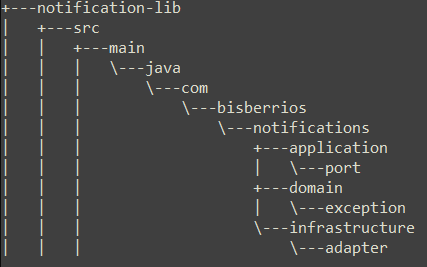

# Notification Library - Backend Challenge
### Autor: Bismarck Berríos
#### Última actualización: 09/02/2026

#### Librería agnóstica a frameworks desarrollada en Java 21, diseñada bajo los principios de Arquitectura Hexagonal y SOLID para unificar el envío de notificaciones (Email, SMS, Push, Slack) de forma resiliente y extensible.

### Arquitectura y Diseño
La librería se basa en un diseño agnóstico, lo que significa que no depende de frameworks como Spring o Quarkus. Toda la configuración se realiza mediante código Java puro.

Principios SOLID Aplicados:
- Single Responsibility (SRP): El dominio (Notification), el procesamiento (ContentProcessor) y la infraestructura (Adapters) están claramente separados.
- Open/Closed (OCP): Es posible agregar nuevos canales creando un nuevo NotificationProvider sin modificar el motor central.
- Interface Segregation & DIP: El cliente interactúa con puertos (TemplateEngine, NotificationProvider), permitiendo desacoplar la lógica de negocio de los proveedores externos.

Patrones de Diseño Utilizados:
- Strategy: Ruteo dinámico de notificaciones al proveedor compatible.
- Builder: Configuración fluida del NotificationClient y RetryConfig.
- Adapter: Traducción del dominio a los requisitos específicos de SendGrid, Twilio y Slack.
- Observer (Pub/Sub): Implementado en NotificationEventBus para el manejo asíncrono de resultados.

### Alcance del reto y decisiones tomadas
Al abordar el reto, prioricé la creación de una librería profesional y resiliente, balanceando la simplicidad de uso con una robustez técnica capaz de manejar fallos de red y validaciones estrictas de dominio.

### Decisiones de diseño
- Arquitectura Hexagonal: Implementé esta arquitectura para separar el dominio inmutable (records) de los adaptadores de infraestructura (SendGrid, Twilio, Slack), garantizando que la lógica de negocio no dependa de librerías externas o frameworks.
- Agnosticismo de Frameworks: Decidí no utilizar anotaciones de Spring (como @Component o @Service), permitiendo que la librería sea inyectada en cualquier proyecto Java puro mediante un Builder fluido y programático.
- Resolución Dinámica de Proveedores (Strategy): El NotificationClient orquesta el envío mediante un flujo de filtrado dinámico que utiliza el método supports(notification) de los proveedores, permitiendo una extensibilidad total sin modificar el cliente (Cumpliendo el principio Open/Closed).
- Dominio Seguro con Java 21: Utilicé una sealed interface para Content y records con constructores compactos para aplicar validaciones Fail-Fast (Regex para emails y teléfonos), asegurando que ninguna notificación mal formada llegue a la capa de infraestructura.
- Resiliencia y Reintentos: Diseñé un sistema de reintentos configurable a través de RetryConfig, permitiendo definir intentos máximos y pausas entre fallos, validado exhaustivamente mediante un FailingAdapter que simula errores persistentes.
- Manejo de Resultados vs Excepciones: Opté por el objeto NotificationResult para comunicar el estado del envío. Esto permite que el procesamiento en lote (sendBatch) sea tolerante a fallos parciales, evitando que una notificación fallida detenga el flujo completo.
- Asincronía mediante Pub/Sub: Implementé un NotificationEventBus basado en CompletableFuture, lo que permite a los consumidores suscribirse a los resultados y procesar envíos en segundo plano de manera no bloqueante.
- Validación con Alta Cobertura: Se alcanzó una cobertura superior al 90% global, testeando no solo los flujos de éxito, sino también los bloques catch de infraestructura y las excepciones de validación de dominio.

### Estructura del proyecto


### Instalación y Configuración
- La librería requiere Maven 3.9+ y Java 21.

- Instalación desde Git:

```cmd
git clone https://github.com/bisberrios/notification-lib.git
cd notification-lib
mvn clean install
```

- Verificar instalación visualmente navegando hasta el path:

~/.m2/repository/com/bisberrios/notifications/notification-lib

- Usar la librería en otro proyecto:

Abre el archivo pom.xml del proyecto donde quieres enviar notificaciones y añade la dependencia dentro de la sección <dependencies>.
Debes usar los mismos datos de groupId, artifactId y version que definidos en la librería:

```xml
<dependency>
    <groupId>com.bisberrios.notifications</groupId>
    <artifactId>notification-lib</artifactId>
    <version>1.0-SNAPSHOT</version>
</dependency>
```

Una vez importada, puedes empezar a configurar el cliente de forma fluida, tal como lo diseñaste en tu arquitectura extensible:

- Usando la Librería (se importan las clases de la librería según requiera):

```java
// Setup de infraestructura
TemplateEngine engine = new SimpleTemplateAdapter();
        ContentProcessor processor = new ContentProcessor(engine);

// Configuración de Cliente Hexagonal
NotificationClient client = NotificationClient.builder()
.provider(new SendGridEmailAdapter(System.getenv("SENDGRID_KEY"), processor, "verificado@empresa.com"))
.provider(new TwilioSmsAdapter(System.getenv("TWILIO_SID"), "+15017122661", processor))
.provider(new SlackNotificationAdapter(System.getenv("SLACK_WEBHOOK"), processor))
.retryConfig(RetryConfig.builder().maxAttempts(3).delayMillis(1000).build())
.build();
```

### Quick Start: Ejemplos de Uso
- Envío con Plantilla (Templates):

```java
Notification email = new EmailNotification("user@test.com", "Bienvenida", 
    new TemplateContent("welcome_v1", Map.of("user", "Bismarck")));
client.send(email);
```

- Envío en Lote (Batch Sending):

```java
NotificationEventBus bus = new NotificationEventBus(client);
bus.subscribe(res -> log.info("Resultado: " + res.success()));
bus.publish(new SmsNotification("+50588888888", new SimpleContent("Hola!")));
```

### Testing y Calidad
La librería cuenta con una cobertura global superior al 90%.

- Validación Fail-Fast: Los constructores de dominio (record) validan formatos (Regex para Email/SMS) antes de procesar, lanzando NotificationValidationException.
- Resiliencia: El sistema de reintentos ha sido testeado mediante un FailingAdapter para garantizar que la lógica de recuperación funcione ante errores de red.
- Branch Coverage: Se cubren todos los caminos críticos, incluyendo bloques catch en los adaptadores para manejar respuestas de proveedores (invalid_payload, no_service).

### Docker
Empaqueta la librería y ejecuta la demo sin configurar Java localmente:

```bash
docker build -t notification-lib-demo .
docker run notification-lib-demo
```

### Seguridad
- Manejo de Credenciales: Se recomienda inyectar API Keys y Tokens mediante variables de entorno al configurar los proveedores en el Builder utilizando herramientas como SecretsManagers(KeyVault, SecretManager, HashicorpVault, etc).
- Validación Estricta: Los validadores aseguran que no se procesen peticiones con formatos de destinatario inválidos.